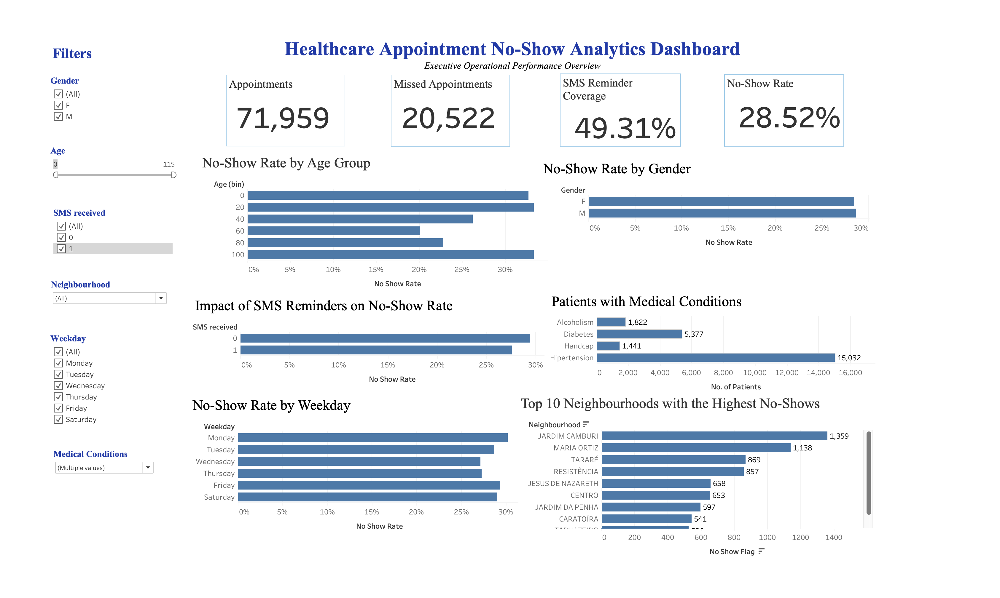

# 🏥 Healthcare Appointment No-Show Analytics Dashboard

> End-to-end healthcare analytics project using **SQL, Python, Pandas, Tableau Public, Git, GitHub, and Visual Studio Code** to analyze patient appointment behavior and build an executive dashboard for operational decision-making.
---
## 📌 Project Overview

Healthcare providers lose valuable time and revenue because of missed appointments. This project analyzes **71,959 patient appointments** to uncover the factors driving appointment no-shows and provides an interactive Tableau dashboard that helps healthcare administrators improve scheduling efficiency and patient engagement.
---
## 🎯 Business Objective

The goal of this project is to:

- Identify patterns behind missed appointments
- Analyze patient demographics and medical conditions
- Measure the impact of SMS reminders
- Discover high-risk neighbourhoods
- Build an executive dashboard for operational insights
---
## Business Questions Answered

- Which patient groups have the highest no-show rates?
- Do SMS reminders reduce missed appointments?
- Which neighbourhoods require operational attention?
- Which weekdays experience the highest appointment no-shows?
- How do medical conditions relate to appointment attendance?
---
## 🛠 Tech Stack

| Tool | Purpose |
|-------|----------|
| SQL (MySQL) | Data querying & business analysis |
| Python | Data cleaning & preprocessing |
| Pandas | Data transformation |
| Jupyter Notebook | Exploratory Data Analysis |
| Tableau Public | Interactive dashboard |
| Visual Studio Code | Development environment |
| Git & GitHub | Version control |
---
## 📂 Repository Structure

```text
├── healthcare_cleaned.csv
├── healthcare_sql_analysis.sql
├── load_to_mysql.py
├── eda.ipynb
├── HealthcareFinalDashboard.twb
├── HealthcareFinalDashboard2.twbx
└── README.md
```
---
## 📊 Dashboard KPIs

- Total Appointments
- Missed Appointments
- No-Show Rate
- SMS Reminder Coverage
- No-Show Rate by Age Group
- No-Show Rate by Gender
- No-Show Rate by Weekday
- Medical Condition Analysis
- Top 10 Neighbourhoods with Highest No-Shows
---
## 🔍 Key Insights

- Nearly **29%** of appointments resulted in no-shows.
- Patients who did not receive SMS reminders had a higher no-show rate.
- Younger patients showed a higher likelihood of missing appointments.
- Certain neighbourhoods consistently experienced significantly higher no-show rates.
- Hypertension was the most common medical condition among patients in the dataset.
---
## 💼 Skills Demonstrated

- Business Analytics
- SQL Querying
- Data Cleaning
- Data Transformation
- Exploratory Data Analysis (EDA)
- Dashboard Development
- Data Visualization
- Healthcare Analytics
- Git & GitHub
- Problem Solving
---
## 📈 Interactive Dashboard

<p align="center">
  
</p>
---
🔗 **Tableau Public Dashboard**

**https://public.tableau.com/app/profile/saloni.nepal/viz/HealthcareAppointmentNo-ShowAnalyticsDashboard/ExecutiveDashboard?publish=yes**
---
## 👩‍💻 Author
**Saloni Nepal**
MBA in Business Analytics | Binghamton University
Aspiring Business Analyst | SQL | Python | Tableau | Power BI | Excel
